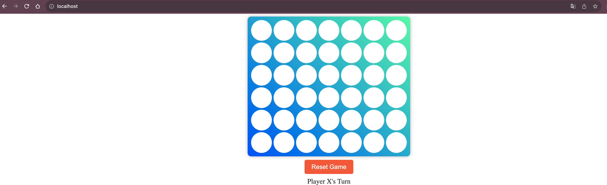

# Connect4
This project, "Connect4," is designed for CS4260 Internet Scale Applications at UVA.

## How to Run

To run the application, follow these steps:

1. Clone this repository.
2. Navigate to the project directory.
3. Run the following command to build the Docker containers:

   ```bash
   docker-compose --build

This command will build the necessary Docker containers and start the application. Once the process completes, you can access the application at `localhost`.

